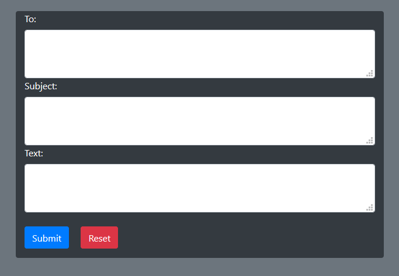
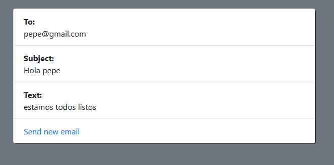

# Sending Email with spring

In this example we send emails using Gmail service

 

App interface:

If the email was sended with success:

Main dependencies

	 <dependency>
	    <groupId>org.springframework</groupId>
	    <artifactId>spring-context-support</artifactId>
	    <version>5.2.5.RELEASE</version>
	</dependency>
	<dependency>
    <groupId>org.springframework.boot</groupId>
   		<artifactId>spring-boot-starter-mail</artifactId>
   		<version>2.2.5.RELEASE</version>
	</dependency>
	

Controller:

        @Controller
	public class EmailController {
	
	@Autowired
	EmailService emailService;
	
	 @PostMapping("/send")
	 public String bookSubmit(@ModelAttribute Email email, BindingResult bindingResult) {
		 

			emailService.sendEmail( email.getTo(), email.getSubject(), email.getBodytext());

		    return "index";
	  }
	 
	 @GetMapping("/")
	 public String bookSubmit(Model model) {
		 
		 	model.addAttribute("Email", new Email());
		
			return "emailInterface";
	  }
     }
     

Interface:
  

	public interface EmailService {

   
    	public void sendEmail( String to, String subject, String bodytext);
	}

Email class:

     @Service
     public class Email implements EmailService {

	private String to;
	private String subject;
	private String bodytext;
	
	@Autowired
    private JavaMailSender javaMailSender;

	public String getTo() {
		return to;
	}

	public void setTo(String to) {
		this.to = to;
	}

	public String getSubject() {
		return subject;
	}

	public void setSubject(String subject) {
		this.subject = subject;
	}

	public String getBodytext() {
		return bodytext;
	}

	public void setBodytext(String bodytext) {
		this.bodytext = bodytext;
	}

	public Email() {
		super();
		// TODO Auto-generated constructor stub
	}

	@Override
	public void sendEmail( String to, String subject, String bodytext) {
       
		SimpleMailMessage msg = new SimpleMailMessage();
		
        msg.setTo(to);
        msg.setSubject(subject);
        msg.setText(bodytext);
        
        javaMailSender.send(msg);
		
	}

	public Email( String to, String subject, String bodytext) {
		super();
	
		this.to = to;
		this.subject = subject;
		this.bodytext = bodytext;
	}	
	}
